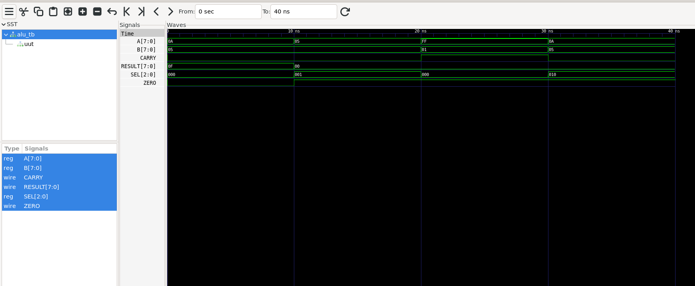
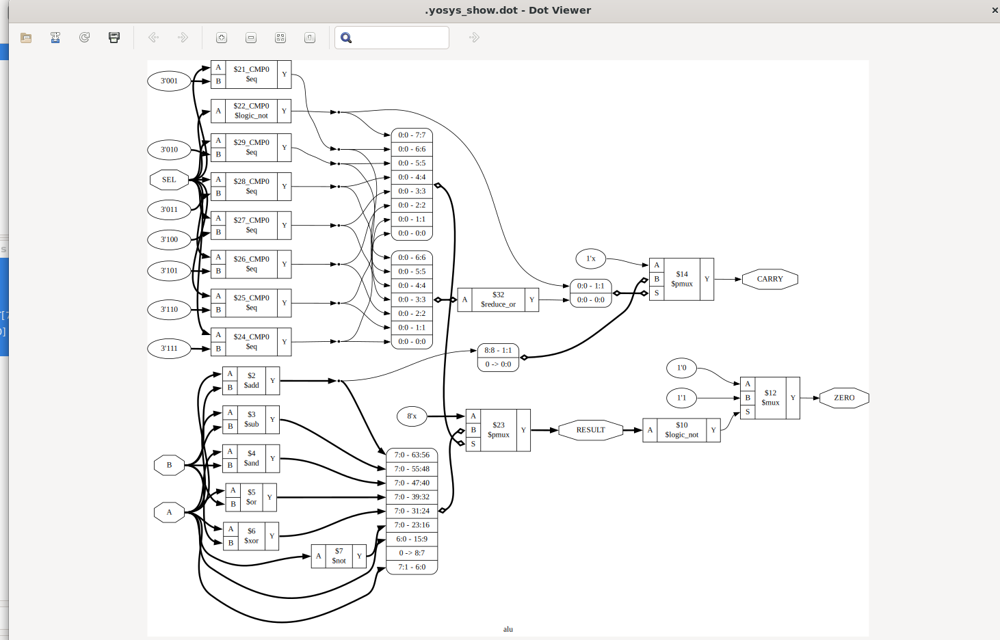

# 8-bit ALU in Verilog HDL

## Overview

This project implements an 8-bit Arithmetic Logic Unit (ALU) using Verilog HDL.

### Features

- Addition
- Subtraction
- AND
- OR
- XOR
- NOT
- Left Shift
- Right Shift
- Zero Flag
- Carry Flag

## Tools Used

- Verilog HDL
- Icarus Verilog
- GTKWave
- Yosys
- Ubuntu WSL

## Simulation Waveform

## RTL Schematic

## Project Flow

Verilog RTL → Testbench → Icarus Verilog → GTKWave → Yosys RTL Synthesis

## Author

Abhishek Chaubey  
B.Tech Electronics Engineering (VLSI Design & Technology)
